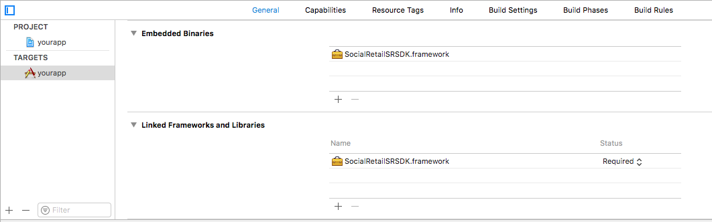
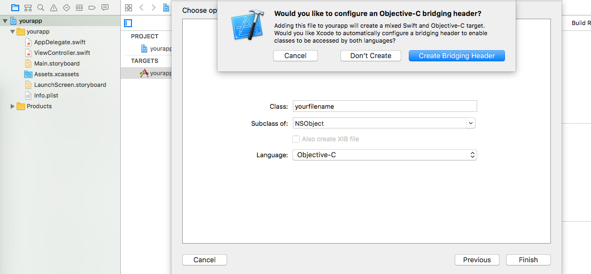

# Digital Social Retail iOS SDK Installation Guide. (Swift 3)
Technical support: support@digitalsocialretail.com

Last production version : 2.2.3 - 19 July 2017

## 1. Introduction

This document is destined to the iOS developer of your app and will guide him to install Digital Social Retail SDK in to your iOS app. The operation should be really simple, because you just need to add entry points into your AppDelegate.h, AppDelegate.m and info.Plist files. No other files will be modified.

Requirements: 
- Xcode 6 or later
- The SDK is compatible with iOS 7.1 or later

## Getting started

[x] Download and Unzip this file : [Download](res/Digital_Social_Retail_SDK_iOS_v2.2.3.zip)

It contains 1 file:
- **SocialRetailSRSDK.framework**: this file contains the public headers that will be used to integrate the sdk in to your application.

[x] Open your Xcode project

[x] Drag and drop SocialRetailSRSDK.framework file in embedded binaries under target of your project. In the popup, choose “Copy items if needed”
like indicated in this screenshot:


[x] Build settings: Go to your application Targets ->Build Settings ->Other Linker Flags and set it to: *-all_load -ObjC* like indicated in this screenshot:


## info.Plist settings

[x] ]Add these rows :

- **NSLocationAlwaysUsageDescription** : < put your text, You can customise the text of this key >
- **NSLocationWhenInUseUsageDescription** : < put your text, You can customise the text of this key >
- **NSLocationAlwaysAndWhenInUseUsageDescription** : < put your text, You can customise the text of this key >
- **NSBluetoothPeripheralUsageDescription** : < put your text, You can customise the text of this key >
- **App Transport Security Settings > Allow Arbitrary Loads : YES**
- **Required background modes > Item 1 : App downloads content from the network**

Your info.plist should looks like:


[x] To import SocialRetailSRSDK header in Swift, add new Objective-C file into your project then xcode will automatically create bridge file which will be named as - "yourfilename-Bridging-Header.h". As shown in below screenshot: 


[x] Import the SDK header: Add import in "yourfilename-Bridging-Header.h" file:
```Objective-C
#import <SocialRetailSRSDK/SocialRetailSRSDK.h>
```

## Modifications to AppDelegate.swift
[x] AppDelegate class should start like this:
```Swift
import UIKit
import UserNotifications
@UIApplicationMain
class AppDelegate: UIResponder,UIApplicationDelegate,UNUserNotificationCenterDelegate,SRBeaconManagerDelegate{
var window: UIWindow?
var srBeaconManager:SRBeaconManager?
```
[x] Main entry point: Here you need to put your Social Retail API Token. To get api token, just <a href="https://cloud.digitalsocialretail.com" target="_blank">Login</a> to your account and click on “My account” and you will see API Token

```Swift
func application(_ application: UIApplication, didFinishLaunchingWithOptions launchOptions: [UIApplicationLaunchOptionsKey: Any]?) -> Bool {

    //Add these lines in the beginning of this method   

        srBeaconManager = SRBeaconManager.sharedManager() as! SRBeaconManager?;
        srBeaconManager?.delegate = self;
        srBeaconManager?.setWSToken("Enter-Social-Retail-API-Token");
        srBeaconManager?.startBeaconDetection();

        UIApplication.shared.registerUserNotificationSettings(UIUserNotificationSettings.init(types: [.alert, .sound], categories: nil));

    return true

}
```


[x] Entry point for localNotifications in the application:

```Swift
func application(_ application: UIApplication, didReceive notification: UILocalNotification) {
    let state = application.applicationState;
    let dict = notification.userInfo;
    srBeaconManager?.showNotification(userInfo: dict, state: state);
}
```

[x] Link AD Web View in your application. To do so, copy below showWebViewController method in your project in the AppDelegate class:

```Swift
public func show(_ webViewController: SRWebViewController!) {        
    let controller = UIApplication.shared.delegate?.window??.rootViewController;
    controller?.present(webViewController, animated: true, completion: nil);        
}
```

[x] Set application state for applicationWillResignActive:

```Swift
func applicationWillResignActive(_ application: UIApplication) {
    srBeaconManager?.willResignActive();
}
```

[x] Set application state for applicationDidBecomeActive:

```Swift
func applicationDidBecomeActive(_ application: UIApplication) {
    srBeaconManager?.didBecomeActive();
}
```

[x] Set application state for applicationWillTerminate:

```Swift
func applicationWillTerminate(_ application: UIApplication) {
    srBeaconManager?.willTerminate();
}
```

## Miscellaneous
If you get this error : *...SocialRetailSRSDK.framework/SocialRetailSRSDK(WebServiceManager.o)' does not contain bitcode*, You must rebuild it with bitcode enabled (Xcode setting ENABLE_BITCODE), obtain an updated library from the vendor, or disable bitcode for this target. for architecture arm64 clang: error: linker command failed with exit code 1 (use -v to see invocation)
Just change Enable bitcode from Yes to No


-   Congratulations, you already integrated Digital Social Retail SDK in to your application.   -

## Test your app

To do so, you need to have one Social Retail beacon with you, configured with a notification message, near your device. Make sure to have internet connection in your device and Bluetooth activated. Launch your app, accept to receive notifications and after 1-5 seconds, you should receive the notification. Then tap on ok and you should see the Ad in full screen. Tap on the button “<” in the header and the Ad should disappear.

Lock your device, wait few seconds and unlock it. Then you should see your app icon in the bottom left of the screen. You can now close the app.

If you need any support, feel free to contact our IT teams by simply sending them a email to support@digitalsocialretail.com


All the best
Digital Social Retail R&D team

## This are some optional methods : 

```Swift

1. srBeaconManager?.setUuidScan("your-uuid-string"); 
    // Description : Set UUID string of beacon.
2. let nearestBeaconsDict = srBeaconManager?.getNearestBeaconInfo();
    // Description : Get nearest beacon.
3. srBeaconManager?.setDebugMode(true);
    // Description : Set debug true or false.
```
